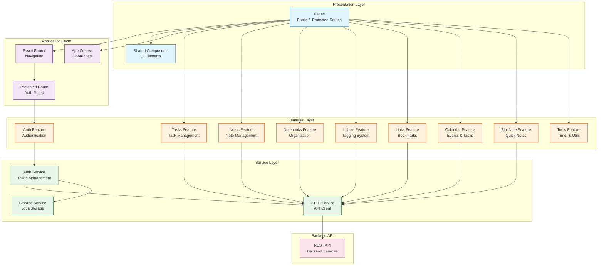

# Diagramme UML - Architecture Globale

## Vue d'ensemble de l'architecture

## Architecture en couches

### 1. Présentation Layer
- **Pages**: Composants de page (publiques et protégées)
- **Shared Components**: Composants UI réutilisables (Layout, Sidebar, Header, etc.)

### 2. Application Layer
- **React Router**: Gestion de la navigation
- **App Context**: État global de l'application (UI state, filters, theme)
- **Protected Route**: Garde d'authentification pour les routes protégées

### 3. Features Layer
Chaque feature est organisée selon le pattern:
- **types.ts**: Interfaces et types TypeScript
- **api.ts**: Couche API pour les requêtes HTTP
- **hooks/**: Custom hooks React pour la gestion d'état
- **components/**: Composants React spécifiques à la feature

Features disponibles:
- **Auth**: Authentification et autorisation
- **Tasks**: Gestion des tâches avec priorités et échéances
- **Notes**: Création et édition de notes riches
- **Notebooks**: Organisation des notes en carnets
- **Labels**: Système d'étiquetage avec couleurs
- **Links**: Gestion des favoris/bookmarks
- **Calendar**: Calendrier avec événements et tâches
- **BlocNote**: Widget de notes rapides avec auto-save
- **Tools**: Utilitaires (timer, etc.)

### 4. Service Layer
- **HTTP Service**: Client API centralisé avec authentification Bearer
- **Auth Service**: Gestion des tokens et refresh automatique
- **Storage Service**: Interface pour localStorage

### 5. Backend API
- REST API avec authentification JWT
- Refresh automatique des tokens sur erreur 401
