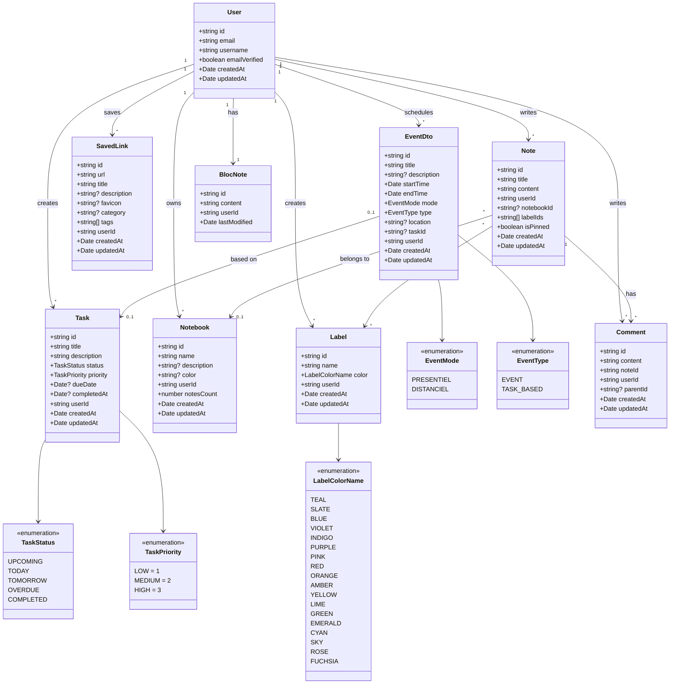
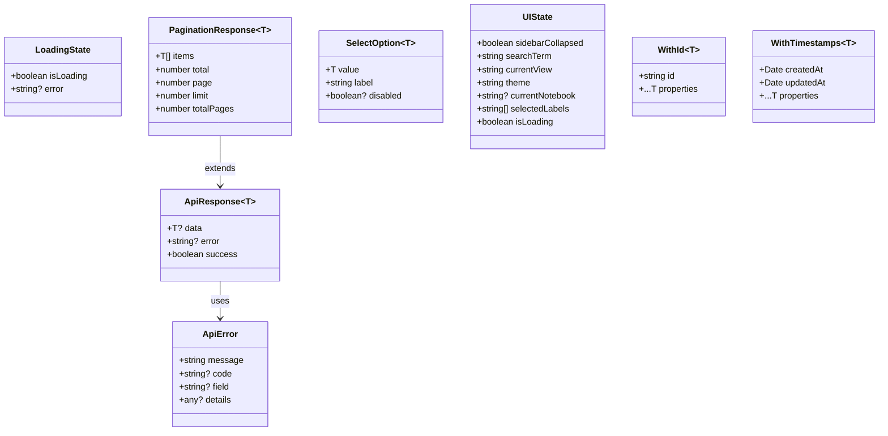
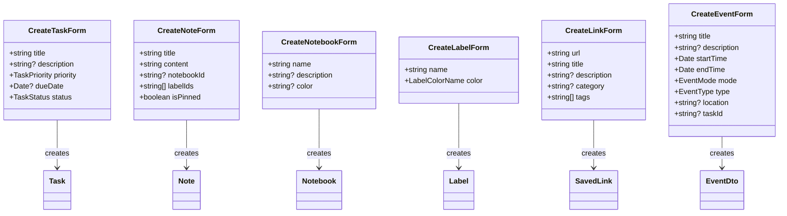

# Diagramme UML - Classes et Types

## Diagramme de classes principal

```mermaid
classDiagram
    class User {
        +string id
        +string email
        +string username
        +boolean emailVerified
        +Date createdAt
        +Date updatedAt
    }

    class Task {
        +string id
        +string title
        +string description
        +TaskStatus status
        +TaskPriority priority
        +Date? dueDate
        +Date? completedAt
        +string userId
        +Date createdAt
        +Date updatedAt
    }

    class TaskStatus {
        <<enumeration>>
        UPCOMING
        TODAY
        TOMORROW
        OVERDUE
        COMPLETED
    }

    class TaskPriority {
        <<enumeration>>
        LOW = 1
        MEDIUM = 2
        HIGH = 3
    }

    class Note {
        +string id
        +string title
        +string content
        +string userId
        +string? notebookId
        +string[] labelIds
        +boolean isPinned
        +Date createdAt
        +Date updatedAt
    }

    class Notebook {
        +string id
        +string name
        +string? description
        +string? color
        +string userId
        +number notesCount
        +Date createdAt
        +Date updatedAt
    }

    class Label {
        +string id
        +string name
        +LabelColorName color
        +string userId
        +Date createdAt
        +Date updatedAt
    }

    class LabelColorName {
        <<enumeration>>
        TEAL
        SLATE
        BLUE
        VIOLET
        INDIGO
        PURPLE
        PINK
        RED
        ORANGE
        AMBER
        YELLOW
        LIME
        GREEN
        EMERALD
        CYAN
        SKY
        ROSE
        FUCHSIA
    }

    class SavedLink {
        +string id
        +string url
        +string title
        +string? description
        +string? favicon
        +string? category
        +string[] tags
        +string userId
        +Date createdAt
        +Date updatedAt
    }

    class EventDto {
        +string id
        +string title
        +string? description
        +Date startTime
        +Date endTime
        +EventMode mode
        +EventType type
        +string? location
        +string? taskId
        +string userId
        +Date createdAt
        +Date updatedAt
    }

    class EventMode {
        <<enumeration>>
        PRESENTIEL
        DISTANCIEL
    }

    class EventType {
        <<enumeration>>
        EVENT
        TASK_BASED
    }

    class Comment {
        +string id
        +string content
        +string noteId
        +string userId
        +string? parentId
        +Date createdAt
        +Date updatedAt
    }

    class BlocNote {
        +string id
        +string content
        +string userId
        +Date lastModified
    }

    User "1" --> "*" Task : creates
    User "1" --> "*" Note : writes
    User "1" --> "*" Notebook : owns
    User "1" --> "*" Label : creates
    User "1" --> "*" SavedLink : saves
    User "1" --> "*" EventDto : schedules
    User "1" --> "*" Comment : writes
    User "1" --> "1" BlocNote : has

    Task --> TaskStatus
    Task --> TaskPriority

    Note "*" --> "0..1" Notebook : belongs to
    Note "*" --> "*" Label : tagged with
    Note "1" --> "*" Comment : has

    EventDto --> EventMode
    EventDto --> EventType
    EventDto "0..1" --> "0..1" Task : based on

    Label --> LabelColorName
```

## Types utilitaires et partagés

```mermaid
classDiagram
    class LoadingState {
        +boolean isLoading
        +string? error
    }

    class ApiResponse~T~ {
        +T? data
        +string? error
        +boolean success
    }

    class ApiError {
        +string message
        +string? code
        +string? field
        +any? details
    }

    class PaginationResponse~T~ {
        +T[] items
        +number total
        +number page
        +number limit
        +number totalPages
    }

    class SelectOption~T~ {
        +T value
        +string label
        +boolean? disabled
    }

    class UIState {
        +boolean sidebarCollapsed
        +string searchTerm
        +string currentView
        +string theme
        +string? currentNotebook
        +string[] selectedLabels
        +boolean isLoading
    }

    class WithId~T~ {
        +string id
        +...T properties
    }

    class WithTimestamps~T~ {
        +Date createdAt
        +Date updatedAt
        +...T properties
    }

    ApiResponse --> ApiError : uses
    PaginationResponse --> ApiResponse : extends
```

## Services et HTTP Layer

```mermaid
classDiagram
    class HttpService {
        -string baseURL
        -number timeout
        -getAuthHeaders() Headers
        +get~T~(url, options?) Promise~T~
        +post~T~(url, data, options?) Promise~T~
        +put~T~(url, data, options?) Promise~T~
        +patch~T~(url, data, options?) Promise~T~
        +delete~T~(url, options?) Promise~T~
        -handleResponse~T~(response) Promise~T~
        -handleError(error) never
    }

    class AuthService {
        -string TOKEN_KEY
        -string REFRESH_TOKEN_KEY
        +login(email, password) Promise~AuthResponse~
        +signup(userData) Promise~AuthResponse~
        +logout() void
        +refreshToken() Promise~string~
        +getAccessToken() string?
        +getRefreshToken() string?
        +isAuthenticated() boolean
    }

    class StorageService {
        +setItem(key, value) void
        +getItem(key) string?
        +removeItem(key) void
        +clear() void
    }

    class TasksApi {
        +getAll(filters?) Promise~Task[]~
        +getById(id) Promise~Task~
        +create(data) Promise~Task~
        +update(id, data) Promise~Task~
        +delete(id) Promise~void~
        +getStats() Promise~TaskStats~
    }

    class NotesApi {
        +getAll(filters?) Promise~Note[]~
        +getById(id) Promise~Note~
        +create(data) Promise~Note~
        +update(id, data) Promise~Note~
        +delete(id) Promise~void~
        +search(query) Promise~Note[]~
    }

    class NotebooksApi {
        +getAll() Promise~Notebook[]~
        +getById(id) Promise~Notebook~
        +create(data) Promise~Notebook~
        +update(id, data) Promise~Notebook~
        +delete(id) Promise~void~
        +getUsageStats(id) Promise~NotebookUsageStats~
    }

    class LabelsApi {
        +getAll() Promise~Label[]~
        +getById(id) Promise~Label~
        +create(data) Promise~Label~
        +update(id, data) Promise~Label~
        +delete(id) Promise~void~
    }

    class LinksApi {
        +getAll(filters?) Promise~SavedLink[]~
        +getById(id) Promise~SavedLink~
        +create(data) Promise~SavedLink~
        +update(id, data) Promise~SavedLink~
        +delete(id) Promise~void~
    }

    class CalendarApi {
        +getEvents(startDate, endDate) Promise~EventDto[]~
        +createEvent(data) Promise~EventDto~
        +updateEvent(id, data) Promise~EventDto~
        +deleteEvent(id) Promise~void~
        +getMonthView(year, month) Promise~CalendarViewDto~
    }

    TasksApi --> HttpService : uses
    NotesApi --> HttpService : uses
    NotebooksApi --> HttpService : uses
    LabelsApi --> HttpService : uses
    LinksApi --> HttpService : uses
    CalendarApi --> HttpService : uses
    AuthService --> HttpService : uses
    AuthService --> StorageService : uses
```

## Context et Hooks

```mermaid
classDiagram
    class AppContext {
        +UIState state
        +dispatch(action) void
        +updateSearchTerm(term) void
        +toggleSidebar() void
        +setTheme(theme) void
        +setCurrentView(view) void
        +selectNotebook(id) void
        +toggleLabel(id) void
        +setLoading(isLoading) void
    }

    class useAuth {
        +User? user
        +boolean isAuthenticated
        +boolean isLoading
        +login(email, password) Promise~void~
        +signup(userData) Promise~void~
        +logout() Promise~void~
        +refreshToken() Promise~void~
    }

    class useTasks {
        +Task[] tasks
        +boolean isLoading
        +string? error
        +fetchTasks(filters?) Promise~void~
        +createTask(data) Promise~Task~
        +updateTask(id, data) Promise~Task~
        +deleteTask(id) Promise~void~
        +getTaskStats() Promise~TaskStats~
    }

    class useNotes {
        +Note[] notes
        +boolean isLoading
        +string? error
        +fetchNotes(filters?) Promise~void~
        +createNote(data) Promise~Note~
        +updateNote(id, data) Promise~Note~
        +deleteNote(id) Promise~void~
        +searchNotes(query) Promise~void~
    }

    class useNotebooks {
        +Notebook[] notebooks
        +boolean isLoading
        +string? error
        +fetchNotebooks() Promise~void~
        +createNotebook(data) Promise~Notebook~
        +updateNotebook(id, data) Promise~Notebook~
        +deleteNotebook(id) Promise~void~
    }

    class useLabels {
        +Label[] labels
        +boolean isLoading
        +string? error
        +fetchLabels() Promise~void~
        +createLabel(data) Promise~Label~
        +updateLabel(id, data) Promise~Label~
        +deleteLabel(id) Promise~void~
    }

    class useLinks {
        +SavedLink[] links
        +boolean isLoading
        +string? error
        +fetchLinks(filters?) Promise~void~
        +createLink(data) Promise~SavedLink~
        +updateLink(id, data) Promise~SavedLink~
        +deleteLink(id) Promise~void~
    }

    class useCalendar {
        +EventDto[] events
        +boolean isLoading
        +string? error
        +fetchEvents(start, end) Promise~void~
        +createEvent(data) Promise~EventDto~
        +updateEvent(id, data) Promise~EventDto~
        +deleteEvent(id) Promise~void~
    }

    useAuth --> AuthService : uses
    useTasks --> TasksApi : uses
    useNotes --> NotesApi : uses
    useNotebooks --> NotebooksApi : uses
    useLabels --> LabelsApi : uses
    useLinks --> LinksApi : uses
    useCalendar --> CalendarApi : uses
```

## Formulaires et validation

```mermaid
classDiagram
    class CreateTaskForm {
        +string title
        +string? description
        +TaskPriority priority
        +Date? dueDate
        +TaskStatus status
    }

    class CreateNoteForm {
        +string title
        +string content
        +string? notebookId
        +string[] labelIds
        +boolean isPinned
    }

    class CreateNotebookForm {
        +string name
        +string? description
        +string? color
    }

    class CreateLabelForm {
        +string name
        +LabelColorName color
    }

    class CreateLinkForm {
        +string url
        +string title
        +string? description
        +string? category
        +string[] tags
    }

    class CreateEventForm {
        +string title
        +string? description
        +Date startTime
        +Date endTime
        +EventMode mode
        +EventType type
        +string? location
        +string? taskId
    }

    CreateTaskForm --> Task : creates
    CreateNoteForm --> Note : creates
    CreateNotebookForm --> Notebook : creates
    CreateLabelForm --> Label : creates
    CreateLinkForm --> SavedLink : creates
    CreateEventForm --> EventDto : creates
```
