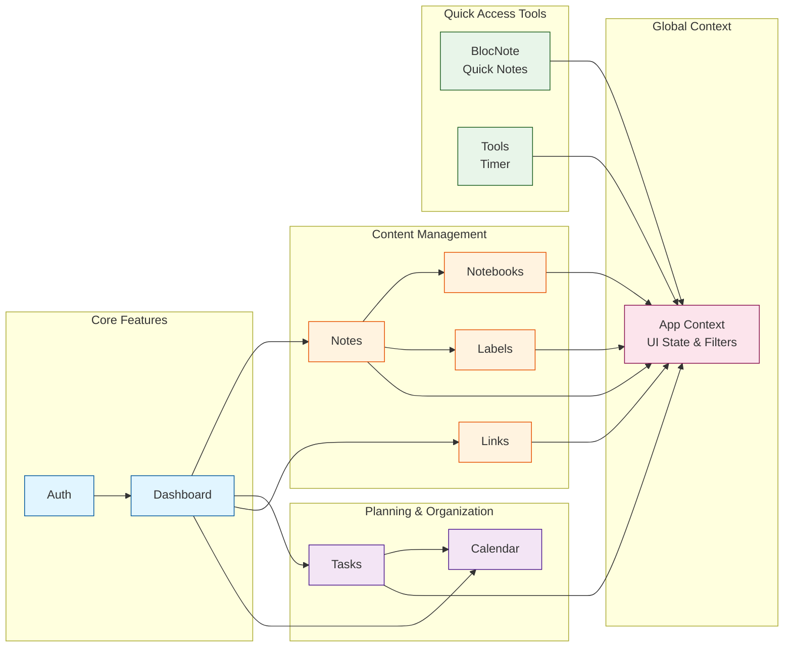
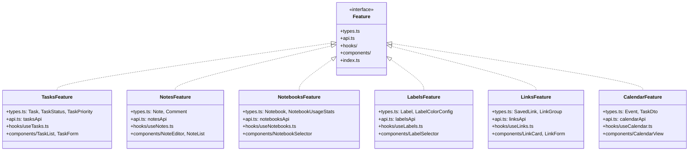
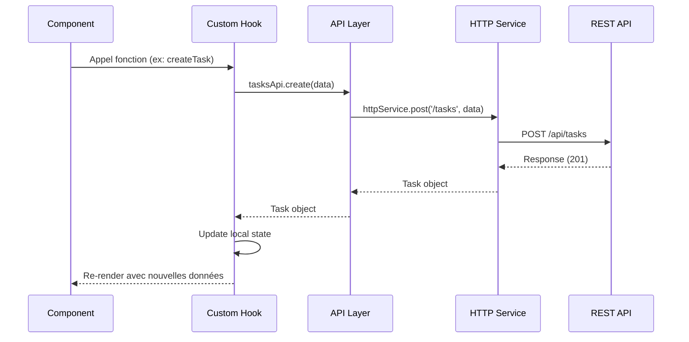

# Diagramme UML - Modules Features

## Relations entre les Features

## Pattern d'organisation des Features

## Flux de données

## Hooks personnalisés par Feature

| Feature       | Hook Principal   | Fonctionnalités                                                  |
| ------------- | ---------------- | ---------------------------------------------------------------- |
| **Tasks**     | `useTasks()`     | fetchTasks, createTask, updateTask, deleteTask, getTaskStats     |
| **Notes**     | `useNotes()`     | fetchNotes, createNote, updateNote, deleteNote, searchNotes      |
| **Notebooks** | `useNotebooks()` | fetchNotebooks, createNotebook, updateNotebook, deleteNotebook   |
| **Labels**    | `useLabels()`    | fetchLabels, createLabel, updateLabel, deleteLabel               |
| **Links**     | `useLinks()`     | fetchLinks, createLink, updateLink, deleteLink, groupLinks       |
| **Calendar**  | `useCalendar()`  | fetchEvents, createEvent, updateEvent, deleteEvent, getMonthView |
| **BlocNote**  | `useBlocNote()`  | fetchBlocNote, saveBlocNote, autoSave                            |
| **Auth**      | `useAuth()`      | login, signup, logout, refreshToken, getCurrentUser              |
