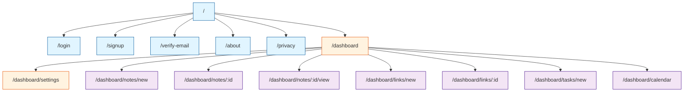
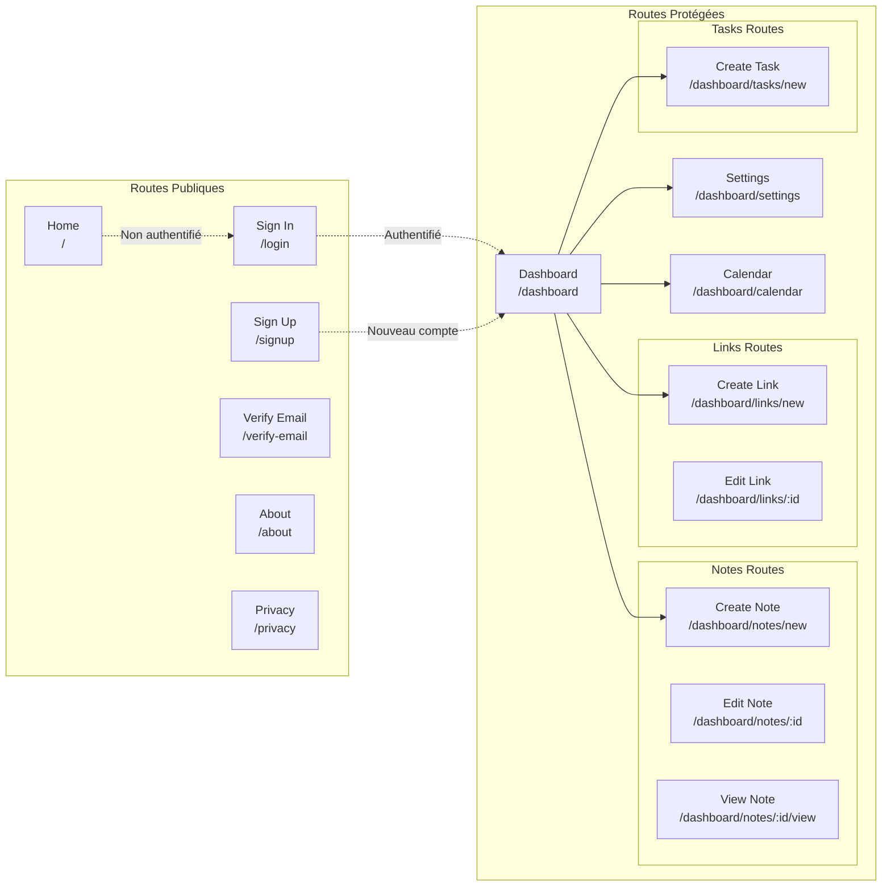
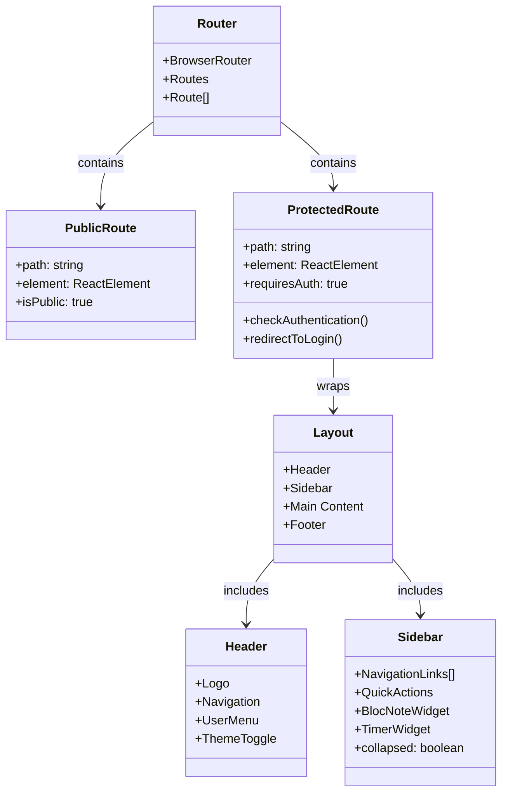
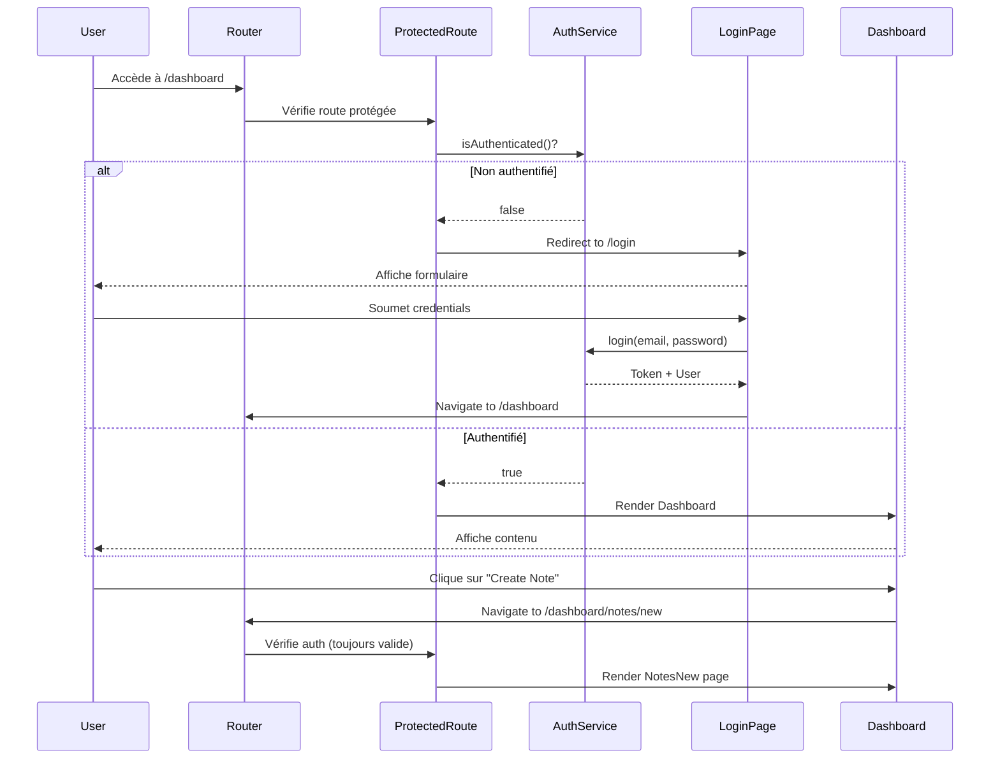
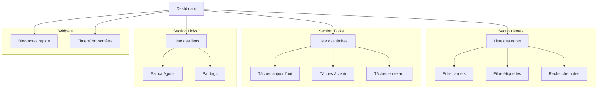
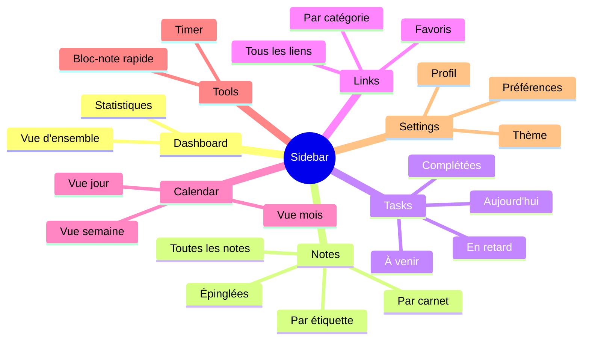
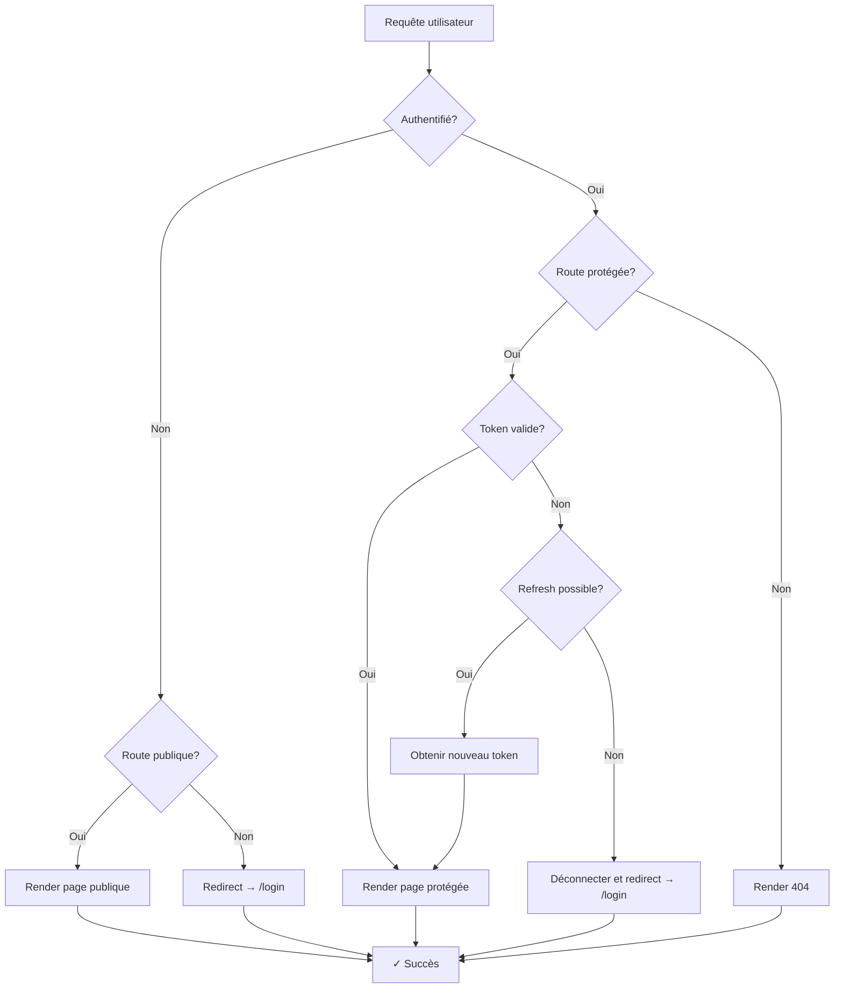
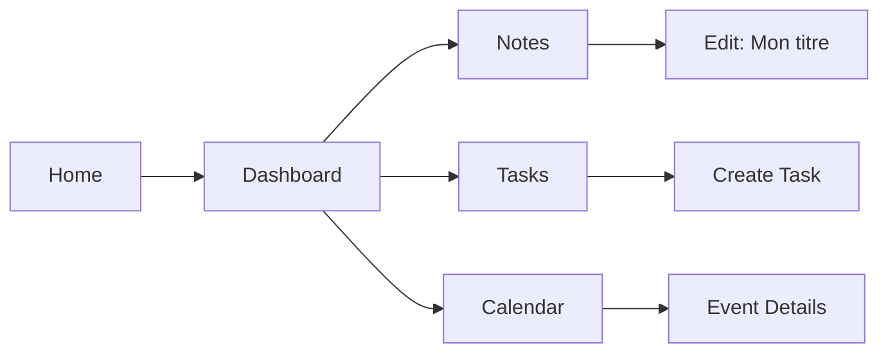

# Diagramme UML - Routes et Navigation

## Structure de navigation

## Routes publiques vs protégées

## Composants de navigation

## Flux d'authentification et navigation

## Carte des routes détaillée

| Route                       | Type      | Composant    | Description                      | Authentification |
| --------------------------- | --------- | ------------ | -------------------------------- | ---------------- |
| `/`                         | Public    | Home         | Page d'accueil avec présentation | Non              |
| `/login`                    | Public    | SignIn       | Formulaire de connexion          | Non              |
| `/signup`                   | Public    | SignUp       | Formulaire d'inscription         | Non              |
| `/verify-email`             | Public    | VerifyEmail  | Vérification d'email             | Non              |
| `/about`                    | Public    | About        | À propos de l'application        | Non              |
| `/privacy`                  | Public    | Privacy      | Politique de confidentialité     | Non              |
| `/dashboard`                | Protected | Dashboard    | Vue d'ensemble principale        | Oui              |
| `/dashboard/settings`       | Protected | UserSettings | Paramètres utilisateur           | Oui              |
| `/dashboard/notes/new`      | Protected | CreateNote   | Créer une nouvelle note          | Oui              |
| `/dashboard/notes/:id`      | Protected | EditNote     | Éditer une note existante        | Oui              |
| `/dashboard/notes/:id/view` | Protected | ViewNote     | Visualiser une note              | Oui              |
| `/dashboard/links/new`      | Protected | CreateLink   | Ajouter un nouveau lien          | Oui              |
| `/dashboard/links/:id`      | Protected | EditLink     | Éditer un lien existant          | Oui              |
| `/dashboard/tasks/new`      | Protected | CreateTask   | Créer une nouvelle tâche         | Oui              |
| `/dashboard/calendar`       | Protected | Calendar     | Vue calendrier                   | Oui              |

## Navigation dans le Dashboard

## Menu de navigation principal (Sidebar)

## Redirections et gestion d'erreurs

## Paramètres de routes dynamiques

| Route                       | Paramètre | Type   | Exemple                        | Utilisation                        |
| --------------------------- | --------- | ------ | ------------------------------ | ---------------------------------- |
| `/dashboard/notes/:id`      | `:id`     | string | `/dashboard/notes/abc123`      | Identifiant unique de la note      |
| `/dashboard/notes/:id/view` | `:id`     | string | `/dashboard/notes/abc123/view` | Identifiant pour vue lecture seule |
| `/dashboard/links/:id`      | `:id`     | string | `/dashboard/links/xyz789`      | Identifiant unique du lien         |

## Query parameters supportés

| Route                 | Query Param | Type   | Exemple            | Description                          |
| --------------------- | ----------- | ------ | ------------------ | ------------------------------------ |
| `/dashboard`          | `view`      | string | `?view=grid`       | Mode d'affichage (grid/list/compact) |
| `/dashboard`          | `notebook`  | string | `?notebook=abc123` | Filtre par carnet                    |
| `/dashboard`          | `label`     | string | `?label=xyz789`    | Filtre par étiquette                 |
| `/dashboard`          | `search`    | string | `?search=react`    | Terme de recherche                   |
| `/dashboard/calendar` | `date`      | string | `?date=2026-01-12` | Date sélectionnée                    |
| `/dashboard/calendar` | `view`      | string | `?view=month`      | Vue du calendrier (month/week/day)   |

## Breadcrumbs et navigation contextuelle

Exemple de breadcrumbs :

- **Home** > **Dashboard** > **Notes** > **Edit Note**
- **Home** > **Dashboard** > **Tasks** > **Create Task**
- **Home** > **Dashboard** > **Calendar** > **January 2026**
